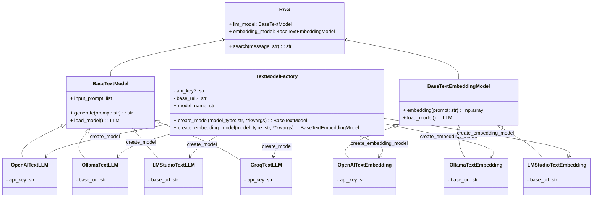

# 1. 구현 모델 및 기능 

<br>

**Platforms**
- OpenAI 
- Ollama
- LMStudio
- Groq

<br>

**Tools**
- RAG(Embedding and vector DB search)

<br>

**Serving**
- Docker and FastAPI 

<br>

<br>

# 2. 아키텍처 

<br>



<br>

OpenAI, Ollama, LMStudio, Groq 4가지 플랫폼에서 제공하는 모델을 모듈화함 

모든 클래스는 상위 추상 클래스인 `BaseTextModel`을 상속 받음 

`BaseTextModel`에는 `generate`, `embedding` method가 추상 method로 설정되어 있으며, 모든 class에서 공통으로 사용하는 `search` method가 구현되어 있음 

각각의 모델 인스턴스는 `Factory` 클래스의 `create_model` method를 통해 생성됨 

<br>

<br>

# 3. python API 사용 방법 

<br>

## 기본 대화 

```python
from src.text import TextModelFactory
import os 

llm = TextModelFactory().create_model(api_key=os.getenviron("OPENAI_API_KEY"))

ai_response = llm.generate(prompt="Who is the president of South Korea?")
```

<br>

## 시스템 프롬프트 설정 

```python
from src.text import TextModelFactory
from src.text.prompt import SystemPrompt
import os 

system_prompt = """
		You are a teacher in charge of 5th grade students. 
		Please answer kindly
		"""

system_prompt = SystemPrompt().set_prompt(system_prompt)
				
factory = TextModelFactory()
llm = factory.create_model(api_key=os.getenviron("OPENAI_API_KEY"))
llm.input_prompt.appned(system_prompt)

ai_response = llm.generate(prompt="Who is the president of South Korea?")
```

<br>

## RAG 

<br>

```python
from src.text import TextModelFactory
from src.text.prompt import SystemPrompt
from src.text.tools import RAG
import os 

# Set teh input documents

documents = [
"The president of South Korea is Yoon Suk-yeol",
"The president of USA is Joe Biden",
"The president of China is Xi Jinping",
"The president of Russia is Vladimir Putin",
"The president of India is Narendra Modi"
]

# Set the input query
query = "who is the president of South Korea?"
  
# Set the prompt for the RAG
input_for_rag = """
I'm going to ask you one question. Generate an answer based on the following document

<Document>
{document}

<Question>
:
"""

# Get API Key
openai_api_key = os.environ.get("OPENAI_API_KEY")

# Set db path
db_path = "db/president.index"

# Get LLM Model
factory = TextModelFactory()
openai_llm = factory.create_model(model_type="openai", 
model_name="gpt-3.5-turbo", 
api_key=openai_api_key)

openai_embedding = factory.create_embedding_model(model_type="openai", 
model_name="text-embedding-ada-002", 
api_key=openai_api_key)

rag_model = RAG(llm_model=openai_llm,
				embedding_model=openai_embedding)

# Save the document as vector database
rag_model.fit(documents=documents,
			  db_path=db_path)

# Search the database and get the related document
related_document = rag_model.search(message=query, db_path=db_path, top_k=1)

  
print("RAG Response:")
print(related_document)
print("\n")

# Set the user prompt
searched_prompt = UserMessage().set_prompt(prompt=input_for_rag.format(document=related_document))

openai_llm.input_prompt.append(searched_prompt)

# Generate the response
openai_response = openai_llm.generate(prompt=query, save_previous=True)
```

<br>

<br>
